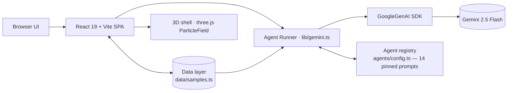

# Haze Agent Suite

> **14 agents. One command center.** A cinematic, 3D multi-agent AI platform that consolidates a dozen focused AI tools into a single streaming workspace — GEO audits, support triage, dynamic pricing, content relevance, code migration, research synthesis, E2E test generation, finance, prioritization, campaigns, legal, podcast production, recruitment screening and multimodal reasoning.


---

## Why this exists

The AI-agent market is fragmented: teams buy **8+ point tools** for audit, support, pricing, content and engineering. Haze Agent Suite is the **anti-fragmentation bet** — one subscription, one workspace, one on-brand rostrum of **14 deterministic agents**, each with SSEP-grade QA discipline baked into the prompt.

| Product gap it closes | Market examples today | Haze answer |
|---|---|---|
| Audit / SEO + LLM visibility tools are separate products | Semrush, Ahrefs (no GEO scoring) | **GEO Engine** — 6-dimension LLM-citation scorecard |
| Support tools analyze sentiment, not root cause | Zendesk, Freshdesk | **SupportOps** — tier classify + log-root-cause + draft reply |
| Pricing tools are enterprise-only | Pricefx, Prisync | **PricePilot** — margin-max reprice table in one prompt |
| Code migration needs consultants | Manual / codemod tools | **CodeBridge** — cross-stack conversion with mapping table |
| Test generation is flaky / framework-locked | Testim, Codecept | **TestForge** — zero-flaky Playwright & Cypress scripts |
| Legal review is expensive | Lawgeex, hot leasecheck | **LegalBeacon** — clause risk + plain-English brief |

---

## The roster

| # | Agent | What it does |
|---|---|---|
| 01 | **GEO Engine** | Generative-Engine Optimization audit: 6 scored dimensions + fix list with before/after copy |
| 02 | **SupportOps** | Support-ticket triage → tier/severity/root-cause + drafted reply + escalation handover |
| 03 | **PricePilot** | SKU reprice recommendation table via elasticity reasoning + 30-day price test plan |
| 04 | **Relevnt** | Topical-relevance score + the 3 gaps to close and the outline to reach 90+ |
| 05 | **CodeBridge** | Cross-framework code migration with mapping table + migration checklist |
| 06 | **ResearchSynth** | Scientific synthesis: claim→evidence pairs, confidence table, research gaps |
| 07 | **TestForge** | Natural-language → strict-locator Playwright/Cypress E2E scripts + Architect's Notes |
| 08 | **EdgeMint** | Income-to-cash-flow diagnosis, 90-day plan, risk-tiered investment tilt |
| 09 | **FocusRank** | Impact×difficulty weighted task ranking + a ready day schedule |
| 10 | **MarketForge** | Campaign brief, 3 ad variants + 30s storyboard rows for social |
| 11 | **LegalBeacon** | Contract clause risk, imbalance flagging + plain-English summary |
| 12 | **PodcastForge** | Research brief → 5-act episode script (with critic loop) → show notes |
| 13 | **RecruitAuditor** | CV-vs-JD compatibility score + SQA-style interview test matrix |
| 14 | **Sentient Hub** | Concurrent text/image/audio reasoning terminal |

---

## Architecture



**Design decisions**
- **One runner, fourteen brains** — every agent shares the same streaming path; a provider swap file (`lib/gemini.ts`) could switch to OpenAI/Groq/Claude.
- **QA by design** — scoring rubrics, boundary examples and disclaimers are pinned into every system prompt (born from an SQA background).
- **Offline-safe** — with no API key the app renders fully and shows a setup message; nothing crashes.
- **Static-first** — SPA + `vercel.json` rewrite ⇒ zero serverless drama, cheap to host.

---

## Quickstart

```bash
npm install
cp .env.example .env.local        # paste your Google AI Studio key
npm run dev                       # http://localhost:5173
npm run build                     # type-safe production build
vercel --prod                     # deploy
```

### Environment

| Variable | Required | Notes |
|---|---|---|
| `VITE_GEMINI_API_KEY` | ✅ | From [Google AI Studio](https://aistudio.google.com/apikey) |
| `VITE_GEMINI_MODEL` | optional | default `gemini-2.5-flash` |

> ⚠️ Never commit `.env.local`. Set these as **Vercel project env vars** (build-time).

---

## Roadmap

- **v1.2** — per-agent conversation memory
- **v1.3** — PDF/Markdown export & preset sharing
- **v2.0** — team workspaces, audit logs, public API + webhooks
- **v2.1** — multimodal drag-and-drop uploads

---

## License

MIT — free to fork, build on, and white-label. Built & maintained by **Hassaan Abdullah Kiyani** (mhklogs) · AI Engineer & SQA Specialist.